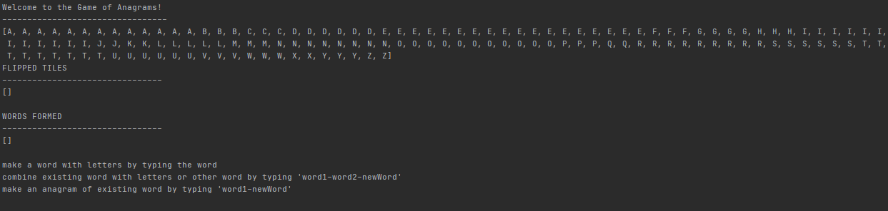

<link href="style.css" type="text/css" rel="stylesheet">

# &#x1F4D6; anagrams

## description
Anagrams is a word game played with small, square tiles that each contain an individual English letter. While not an officially produced game, the game can be played using a set of [Bananagrams](https://en.wikipedia.org/wiki/Bananagrams) tiles.
The game is played by putting all tiles face down and gradually turning the tiles over, pausing after each one to allow for word formation.

Words (**>= 3 letters**) can be formed in the following ways:
1. individual flipped tiles combined to form a word **M G E -> GEM**
2. flipped tile(s) plus an existing word formed to make a new word **R CAT -> CART** or **T S BALE -> STABLE**
3. existing word(s) formed with other existing word(s) to make a new word **LUMEN BINARY -> INNUMERABLY**
4. strict anagram: anagram of an existing word **FEEL -> FLEE**

A restriction in forming words: **you cannot form a word that has been previously formed**

The person who forms the word, gets the word. So the game is a continual cycle of tiles shifting ownership. A winner is determined as the one with the most words formed following the overturn of the last tile.

## problem
We need a way to represent a given board state. Effectively a board state has two groups of items. One group is the set of flipped, unclaimed tiles. The other group is the set of built words.

We need a way to look at both groups and check if a new word can be formed in any of the 4 ways listed above.\
We need to have a collection of acceptable English words.\
We want to minimize computation time.

**Goal : Find as many word formations (ways 2-4) as possible for each word in the set of built words.**

## approach
- a **Game** class (for prompting user and running the game)
- a **Table** class (for tracking the board and housing the functions required to solve the board)
- a **Word** class (for built words, to practice OOP principles, and for extensibility options)

a **Word** object has the following member variables
```java
private String name;
private int length;
```
a **Table** object has the following member variables
```java
private ArrayList<Word> words; // formed words
private ArrayList<String> charactersUp; // flipped tiles
private ArrayList<String> charactersRemaining; // unflipped tiles
private ArrayList<String> dictionary; // list of acceptable English words
private ArrayList<String> wordsToNotUse; // list of all words that have already been formed
```
*dictionary* is populated with words from [this](../resources/dictionary.txt) Scrabble dictionary. It is then sorted **by length**
```java
Collections.sort(dictionary, Comparator.comparing(String::length));
```
*charactersRemaining* is populated with letters following the Bananagrams' letter distribution
```java
charactersRemaining = new ArrayList<>(Arrays.asList("A", "A", "A", ... "J", "J", "K", "K", ... "Z", "Z"));
```
A random element, representing a tile, is taken from *charactersRemaining* each time *__flipTile()__* is called
```java
public String flipTile(){
    Random rand = new Random();
    int number = rand.nextInt(charactersRemaining.size());
    String flipped = charactersRemaining.get(number);
    charactersUp.add(flipped);
    charactersRemaining.remove(number);
    return flipped;
}
```
Consider how the user selection for forming a word is taken in **Game**
```java
System.out.println("make a word with letters by typing the word");
System.out.println("combine existing word with letters or other word by typing 'word1-word2-newWord'");
System.out.println("make an anagram of existing word by typing 'word1-newWord'");
String response = input.next().toUpperCase();
```
And later, to parse *response*
```java
String [] potential = response.split("-");
if(potential.length == 3){
    int word1Index = 0;
    int word2Index = -1;

    ArrayList<Word> myWordList = myTable.getWords();
    for(int lcv = 0; lcv < myWordList.size(); lcv ++){
        if(myWordList.get(lcv).getName().equals(potential[0])){
            word1Index = lcv;
        }
        if(myWordList.get(lcv).getName().equals(potential[1])){
            word2Index = lcv;
        }
    }

    if(word2Index == -1){
        Word addOn = new Word(potential[1]);
        myTable.mergeWordAndWord(myWordList.get(word1Index), addOn, potential[2], false);
    }
    else{
        myTable.mergeWordAndWord(myWordList.get(word1Index), myWordList.get(word2Index), potential[2], true);
    }
}
else if(potential.length == 2){
    int word1Index = 0;
    
    ArrayList<Word> myWordList = myTable.getWords();
    
    for(int lcv = 0; lcv < myWordList.size(); lcv ++){
        if(myWordList.get(lcv).getName().equals(potential[0])){
            word1Index = lcv;
        }
    }
    myTable.claimAnagram(myWordList.get(word1Index), potential[1]);
}
else{
    myTable.mergeLetters(response.split(""), response);
}
```
The user indicates how they want to form a word, and with which word(s) and/or letter(s)\
*__mergeLetters()__* or *__mergeWordAndWord()__* or *__claimAnagram()__* are called accordingly
```java
public boolean mergeLetters (String [] letters, String proposed){
    if(isInDictionary(proposed)){
        Word newWord = new Word(proposed);
        words.add(newWord);
        for(int lcv = 0; lcv < letters.length; lcv ++){
            this.charactersUp.remove(letters[lcv]);
        }
        return true;
    }
    return false;
}
```
```java
public boolean mergeWordAndWord (Word original, Word toAdd, String proposed, boolean mode){
    String addString = toAdd.getName();
    String workOn = original.getName() + addString;

    if(isAnagram(workOn.split(""), proposed.split(""))){
        original.setName(proposed);
        if(mode){ // toAdd was a Word
            words.remove(toAdd);
        }
        else{ // toAdd was letters
            String [] toDelete = addString.split("");
            for(int lcv = 0; lcv < toDelete.length; lcv ++){
                charactersUp.remove(toDelete[lcv]);
            }
        }
        return true;
    }
    return false;
}
```
```java
public boolean claimAnagram (Word original, String proposed){
    if(isAnagram(original.getName().split(""), proposed.split(""))){
        int index = getWordIndex(original.getName());
        words.get(index).setName(proposed);
        return true;
    }
    return false;
}
```
As seen, when making a word from letters only, it is easily validated as an English word by calling *__isInDictionary()__*
```java
public boolean isInDictionary(String w){
    return dictionary.contains(w);
}
```
When making a word using an existing word, the problem is a bit trickier\
Because of the clever way we took in *response*, however, we can tell if a proposed word is legal to make\
*__isAnagram()__* accomplishes this
```java
public boolean isAnagram(String [] w1, String [] w2){
    if(w1.length != w2.length){
        return false;
    }

    Map<String, Integer> map1 = new HashMap<>();
    Map<String, Integer> map2 = new HashMap<>();
    String word = "";

    for(int lcv = 0; lcv < w1.length; lcv ++){
        word += w2[lcv];
        if(map1.putIfAbsent(w1[lcv], 1) != null){
            map1.put(w1[lcv], map1.get(w1[lcv]) + 1);
        }
        if(map2.putIfAbsent(w2[lcv], 1) != null){
            map2.put(w2[lcv], map2.get(w2[lcv]) + 1);
        }
    }
    for(int lcv = 0; lcv < w1.length; lcv ++){
        if(map1.get(w1[lcv]) != map2.get(w1[lcv])){
            return false;
        }
    }
    return isInDictionary(word);
}
```
So far, we have just implemented the game itself, there is no solving of a particular board state occuring\
To effect this, *__buildAnagrams()__* finds all anagrams of a given word
```java
public ArrayList<String> buildAnagrams (Word original){
    String myWord = original.getName();
    String [] myWordList = myWord.split("");

    ArrayList<String> toReturn = new ArrayList<>();

    for(int lcv = 0; lcv < dictionary.size(); lcv ++){
        String workingOn = dictionary.get(lcv);
        if(workingOn.length() > myWord.length()){
            break;
        }
        if(workingOn.length() < myWord.length() - 1){
            lcv += 1000;
        }
        if(myWord.length() == workingOn.length()){
            if(!wordsToNotUse.contains(dictionary.get(lcv)) && isAnagram(myWordList, workingOn.split(""))){
                toReturn.add(workingOn);
            }
        }
    }
    
    return toReturn;
}
```
This method is called directly from **Game**, depending on if the user decides to solve\
For clarity, the following code will take all flipped tiles and all formed words and find:
 - **all** possible anagrams
 - **all** possible 1 away words
 - **all** possible 2 away words\
where "# away word" is a word makeable from existing word plus that # of flipped tiles

```java
ArrayList<String> characters = myTable.getFlippedTiles();
ArrayList<Word> myWordList = myTable.getWords();

Set<String> noAway = new HashSet<>();
Set<String> oneAway = new HashSet<>();
Set<String> twoAway = new HashSet<>();

ArrayList<String> possible = new ArrayList<>();

// strict anagram
for(int lcv = 0; lcv < myWordList.size(); lcv ++){
    possible = myTable.buildAnagrams(new Word(myWordList.get(lcv).getName()));
    for(int lcv2 = 0; lcv2 < possible.size(); lcv2 ++){
        if(!possible.get(lcv2).equals(myWordList.get(lcv).getName())){
            String tan = "\033[38;2;163;152;109m" + possible.get(lcv2) + "\033[0m";
            noAway.add(tan);
        }
    }
    possible.clear();

    // word + 1 flipped letter
    for(int lcv2 = 0; lcv2 < characters.size(); lcv2 ++){
        String newPossibility = myWordList.get(lcv).getName() + characters.get(lcv2);

        possible = myTable.buildAnagrams(new Word(newPossibility));
        for(int lcv3 = 0; lcv3 < possible.size(); lcv3 ++){
            String bronze = "\033[38;5;136m" + possible.get(lcv3) + "\033[0m";
            oneAway.add(bronze);
        }
        possible.clear();

        // word + 2 flipped letters
        for(int lcv3 = 0; lcv3 < characters.size(); lcv3 ++){
            if(lcv3 != lcv2){
                String nextPossibility = newPossibility + characters.get(lcv3);
                possible = myTable.buildAnagrams(new Word(nextPossibility));
                for(int lcv4 = 0; lcv4 < possible.size(); lcv4 ++){
                    String gold = "\033[38;2;212;179;13m" + possible.get(lcv4) + "\033[0m";
                    twoAway.add(gold);
                }
                possible.clear();

                // word + 3 flipped letters
//                                for(int lcv4 = 0; lcv4 < characters.size(); lcv4 ++){
//                                    if(lcv4 != lcv3 && lcv4 != lcv2){
//                                        String newestPossibility = nextPossibility + characters.get(lcv4);
//                                        possible = myTable.buildAnagrams(new Word(newestPossibility));
//                                        for(int lcv5 = 0; lcv5 < possible.size(); lcv5 ++){
//                                            anagrams.add(possible.get(lcv5));
//                                        }
//                                        possible.clear();
//                                    }
//                                }
            }
        }
    }
    int totalAway = oneAway.size() + twoAway.size();
    String front = myWordList.get(lcv) + "(" + totalAway + ") : ";
    System.out.format("%-11s %s\n", front, noAway);
    System.out.format("%-11s %s\n", " ", oneAway);
    System.out.format("%-11s %s\n", " ", twoAway);
    System.out.println();
    noAway.clear();
    oneAway.clear();
    twoAway.clear();
}
```

## result

<div class="container">
  <div class="text">
    <p>Starting the program, no tiles flipped, no words formed, prompting user for input</p>
  </div>
  <div>
    
  </div>
  <div class="text">
    <p>Populating the board by flipping tiles randomly</p>
  </div>
  <div class="image">
    
  </div>
  <div class="text">
    <p>Forming initial words from flipped letters, flipping more lettings</p>
  </div>
  <div class="image">
    
  </div>
  <div class="text">
    <p>Solving the board by building every possible strict, 1 away, 2 away, and combined word anagram</p>
  </div>
  <div class="image">
    
  </div>
  <div class="image">
    
  </div>
</div>

## source code
### [Game](../src/Game.java)
### [Table](../src/Table.java)
### [Word](../src/Word.java)
